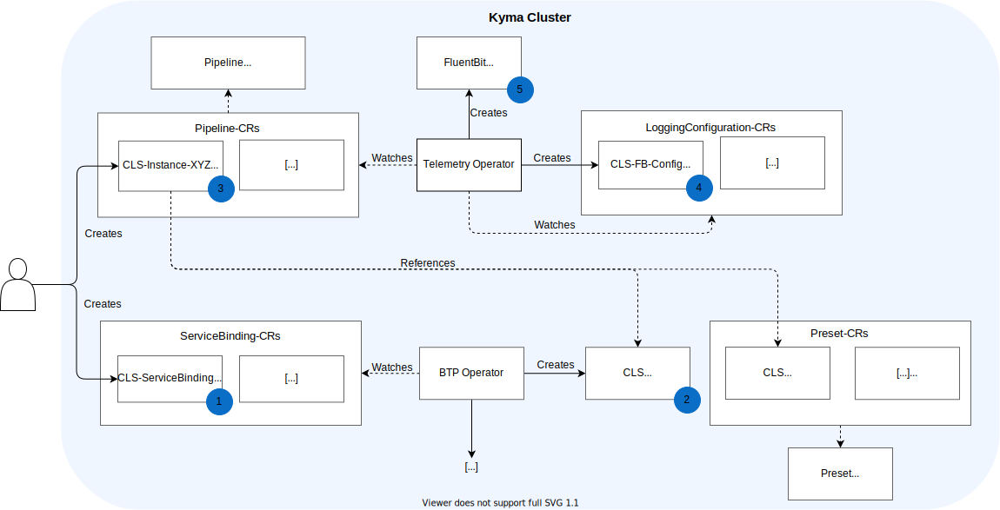

# Concept

Goal: Telemetry operator should be extended to a kind of automatic templating to be used in combination with the ServiceCatalog.

The original workflow for a user creating a ServiceBinding remains unchanged, which keeps the user workflow easier. There is no advantage of changing the user workflow. We also thought of changing the workflow to have a more automated setup, but this would require more knowledge of the user to actually perform the ServiceBinding with the automated FluentBit Configuration.
Instead, the workflow will be expanded by one additional step to create the FluentBit configuration for the corresponding ServiceBinding.

This concept covers the basic requirements with a minimal setup and reusing the Telemetry Operator for this purpose. At a later point, the Telemetry Operator could be split up to have a cleaner operator architecture, but this needs to be discussed further in the future.

## General Architecture / Workflow:

The following Workflow is explained in the context of the BTP Operator's ServiceBinding. The user can also refer to a Secret which is created by another instance or by the user. In this case, step one and two are skipped, and in step three the user refers to a custom Secret.

1. User creates ServiceBinding using CLI, BTP, or Busola.
2. BTP Operator watches ServiceBinding-CRs and creates corresponding Secret.
3. User Creates Pipeline-CR and references to the Secret created by the BTP Operator. Furthermore, the user must specify which Preset should be used.
4. Telemetry Operator watches Pipeline-CRs. If a new CR is created, it creates a new LoggingConfiguration-CR, using the Preset and the information given by the referenced Secret.
5. Telemetry operator creates new FluentBitConfig based on LoggingConfiguration-CR.

## Templating

To map the key-value pairs given by the referenced Secret, we need a CRD that maps the keys of the Secret to the corresponding FluentBit Output keys. Thus, the `Preset`-CRD is needed. This CRD is defined by:
- Name
- Mapping from Secret keys to FluentBit keys
- The filter and output plugins of FluentBit that are to be used
- Configuration of these filters and outputs

Kyma will then have predefined Preset-CRs, which the customer can use to create a FluentBit configuration based on the customer's created ServiceBinding. In this way, the users does not have to care about maintaining filters (i.e. `Lua` scripts), configuration of outputs (i.e. `http`-Plugin), etc.

## Secret Rotation

In this concept, the user refers to the Secret created by the BTP Operator, which is then mounted by the Telemetry Operator in the corresponding container. Therefore, the Secret rotation happens automatically by the general function of the Telemetry Operator.

> **NOTE:** The Secret rotation is not implemented in the Telemetry Operator until now (as of today; 15.10.2021).

# Extensibility for OpenTelemetry Collector Instances

The shown concept should be future-proof to be used for a controller or operator that manages OpenTelemetry Collector as well.
Even though, a controller for the OpenTelemetry Collector is not part of Kyma yet, its CRD would have to meet the following requirement separate the configuration's structure from specific settings that have to be filled from Kubernetes Secrets.

## OpenTelemetry Collector CRD Requirements

In contrary to the FluentBit pipelines, where stages are connected by labels, the OpenTelemetry Collector configuration contains explicit pipeline descriptions.
These pipeline descriptions connects Receivers, Processors and Exporters.
This design does not allow to modify the configuration by appending raw snippets as the telemetry-operator does for the LoggingConfiguration CRD.

The option to have pipelines to be extended by the user is a requirement for the future use of OpenTelemetry Collectors.
This includes in particular adding new Exporters to a predefined pipeline.
A future OpenTelemetry Collector API / CRD should allow inputs of Receivers, Processors and Exporters by the user.
The resulting service and pipeline definition is generated by the controller in the next step.
Defining this CRD in a way that allows the user again to paste the raw configuration section, which might reference Secrets, fulfills the minimal requirement to adapt the templating mechanism for service consumption.

The upstream [OpenTelemetry Operator](https://github.com/open-telemetry/opentelemetry-operator) only accepts entire Collector configurations and thus, does not allow to specify extensible pipelines.

## Unified Templating for Logging and OpenTelemetry

The OpenTelemetry Collector configuration should, beside the logging configuration, be a second sub-resource in the Preset.
This allows services to consume different types of telemetry. E.g., an Elastic stack could consume both logs and traces.
